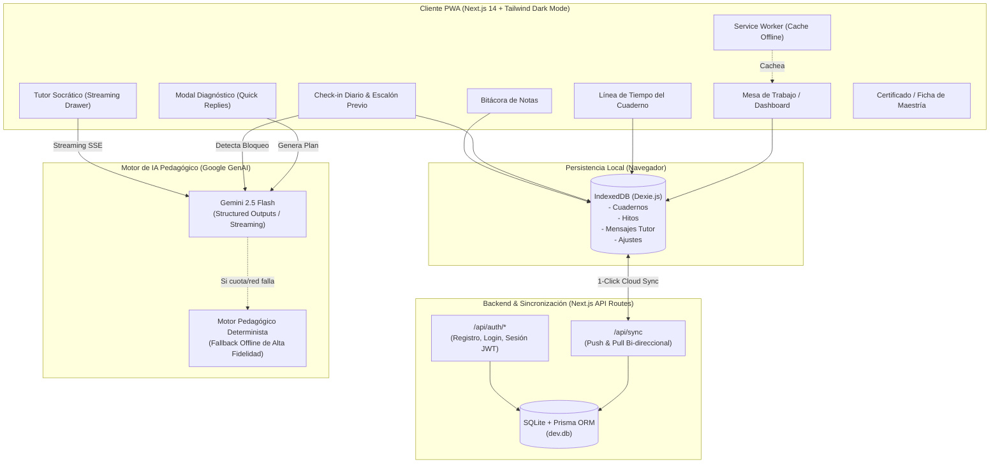

# 🥋 Maestro Kaizen (改善)
### Plataforma de Aprendizaje Acelerado, Adaptativo y Offline-First

[](https://vercel.com/new/clone?repository-url=https%3A%2F%2Fgithub.com%2Ftu-usuario%2Fmaestro-kaizen&env=GEMINI_API_KEY,JWT_SECRET,DATABASE_URL)

> **"Mejora continua en incrementos del 1% diario, andamiaje pedagógico reactivo y micro-hábitos atómicos."**

**Maestro Kaizen** es una Progressive Web App (PWA) de alto rendimiento inspirada en el diseño minimalista de NotebookLM y Linear. Combina la potencia del modelo **Gemini 2.5 Flash** con una arquitectura de persistencia dual: **offline-first local inmediata en IndexedDB (Dexie.js)** y sincronización en la nube mediante **Prisma y SQLite**.

---

## 🌟 Características Nucleares

- ⚡ **Entrevista Diagnóstica Adaptativa**: Diálogo socrático guiado de 3 a 4 intercambios con respuestas rápidas de 1 toque (*quick replies*) para identificar la brecha exacta del estudiante.
- 🗺️ **Roadmap Kaizen Estructurado**: Generación de planes diarios progresivos respetando la Zona de Desarrollo Próximo (ZDP de Vygotsky), con micro-teorías concisas, focos sensoriales y enlaces directos a tutoriales técnicos en YouTube.
- 🪜 **Andamiaje Reactivo (Escalón Previo)**: Si el usuario reporta un bloqueo o dificultad, el motor de IA inserta inmediatamente una micro-regresión biomecánica o conceptual aislada de 5 minutos antes del hito.
- 🤖 **Tutor Socrático 24/7 en Streaming**: Asistente pedagógico disponible en cualquier momento mediante drawer deslizable con respuestas en tiempo real (token streaming).
- 🏆 **Desafío Final Integrador (Capstone)**: Celebración visual con confeti (`canvas-confetti`) y generación instantánea de la **Ficha de Maestría Kaizen** imprimible en PDF o descargable en Markdown.
- 📴 **100% Offline-First (PWA)**: Service Worker que cachea assets estáticos y Dexie.js para operar sin conexión a internet ni pérdida de datos.
- 🔒 **Autenticación Ligera sin Email**: Registro e inicio de sesión únicamente con Nombre de Usuario y Contraseña, con cookies `httpOnly` y tokens JWT.

---

## 🏛️ Arquitectura del Sistema



---

## 🛠️ Stack Tecnológico

| Capa | Tecnologías |
| :--- | :--- |
| **Frontend** | [Next.js 14 (App Router)](https://nextjs.org), React 18, TypeScript |
| **Estilos & UI** | [Tailwind CSS](https://tailwindcss.com), Lucide Icons, Canvas Confetti |
| **Persistencia Local** | [Dexie.js](https://dexie.org) (IndexedDB Wrapper) |
| **Backend & ORM** | Next.js Route Handlers, [Prisma ORM](https://www.prisma.io), SQLite |
| **Inteligencia Artificial** | [`@google/genai`](https://www.npmjs.com/package/@google/genai) con `gemini-2.5-flash` |
| **PWA & Offline** | Web App Manifest, Service Worker nativo cache-first |
| **Autenticación** | `bcryptjs`, `jsonwebtoken`, Cookies `httpOnly` |

---

## 🚀 Puesta en Marcha Local

### Prerrequisitos
- Node.js 18.17 o superior.
- Clave de API de Google Gemini ([Google AI Studio](https://aistudio.google.com/)). *(Opcional: Si no se provee, la app funciona de forma autónoma con el motor pedagógico determinista integrado)*.

### 1. Clonar el repositorio e instalar dependencias
```bash
git clone https://github.com/tu-usuario/maestro-kaizen.git
cd maestro-kaizen
npm install
```

### 2. Configurar Variables de Entorno
Copia el archivo `.env.example` a `.env.local` y `.env`:

```bash
cp .env.example .env.local
cp .env.example .env
```

Edita `.env.local` con tus credenciales:
```env
# Google Gemini API
GEMINI_API_KEY="tu_gemini_api_key_aqui"

# Seguridad y Autenticación JWT
JWT_SECRET="genera_una_clave_secreta_segura_de_al_menos_32_caracteres"

# Base de Datos SQLite para Sincronización
DATABASE_URL="file:./dev.db"

# Entorno
NODE_ENV="development"
```

### 3. Inicializar la Base de Datos SQLite (Prisma)
```bash
npx prisma migrate dev --name init
```

### 4. Iniciar el Servidor de Desarrollo
```bash
npm run dev
```

Abre [http://localhost:3000](http://localhost:3000) en tu navegador.

---

## 🚢 Despliegue en Producción (Vercel)

1. Haz un fork o sube el repositorio a GitHub.
2. Crea un nuevo proyecto en [Vercel](https://vercel.com/new).
3. Configura las siguientes Variables de Entorno en el panel de Vercel:
   - `GEMINI_API_KEY`: Tu API key de Gemini.
   - `JWT_SECRET`: Una cadena secreta aleatoria segura.
   - `DATABASE_URL`: Si deseas sincronización en producción, puedes usar `file:/tmp/dev.db` o conectar una base de datos PostgreSQL/Turso/LibSQL compatible con Prisma.
4. Haz clic en **Deploy**.

> ⚠️ **Nota:** SQLite (`dev.db`) es efímero en entornos serverless (Vercel, AWS Lambda). Para producción persistente, migrar a Turso, Supabase o PostgreSQL.

---

## 🧪 Verificación y Testing

El proyecto incluye scripts de verificación automatizada de extremo a extremo:

```bash
# Probar el ciclo de vida completo de un aprendiz (Diagnóstico, Escalón Previo y Capstone)
node scratch/test-full-user-lifecycle.js

# Probar la inserción reactiva de andamiaje ante bloqueos biomecánicos
node scratch/test-checkin-scaffolding.js

# Probar los cuatro módulos pedagógicos de IA
node scratch/test-all-ai-modules.js
```

Para validar tipos y calidad de código:
```bash
npm run lint
npm run build
```

---

## 📜 Licencia

Desarrollado con el espíritu **Kaizen (改善)** de mejora constante. Licencia MIT.
